# TuitionPlatform
A very simple DB project. Just to feel project vibe!

**Author: Md. Mazharul Islam & Arham Ahmmad Adil**

### How to Run the Project (Recommended Way)

**Requirements:** xampp (includes Apache Server & MySQL)

#### Steps:

1. Start Apache and MySQL services from the XAMPP Control Panel.

2. Make sure the project folder is placed inside the htdocs directory: xampp/htdocs/TuitionPlatform

3. Open your web browser and navigate to: http://localhost/TuitionPlatform/index.php

You should now see the homepage of the Tuition Platform.

### Tech Stack

**Frontend:**
- HTML  
- CSS  
- Bootstrap  
- JavaScript

**Backend:**
- PHP

**Database:**
- MySQL

## Some snap shots of this project

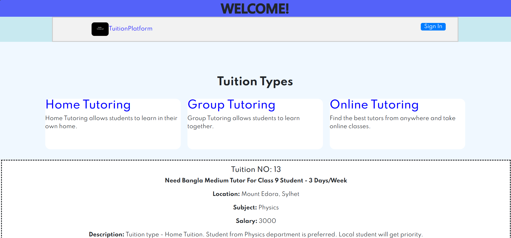

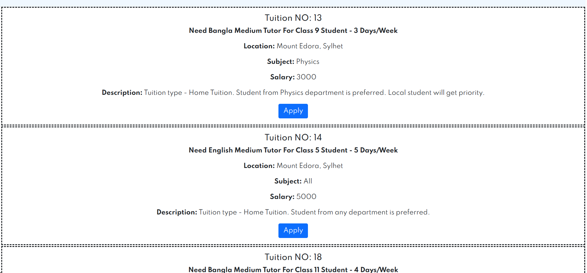

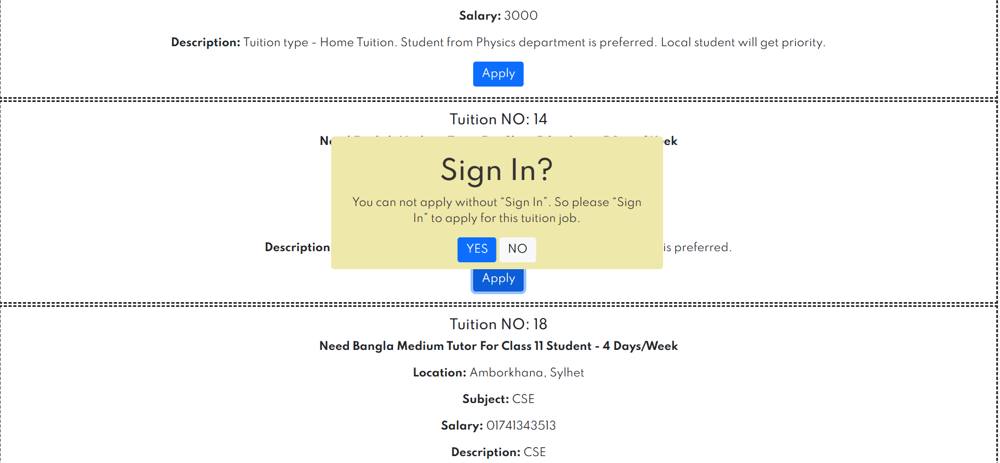

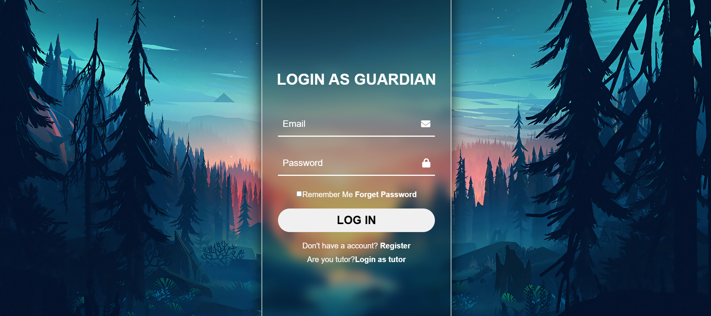

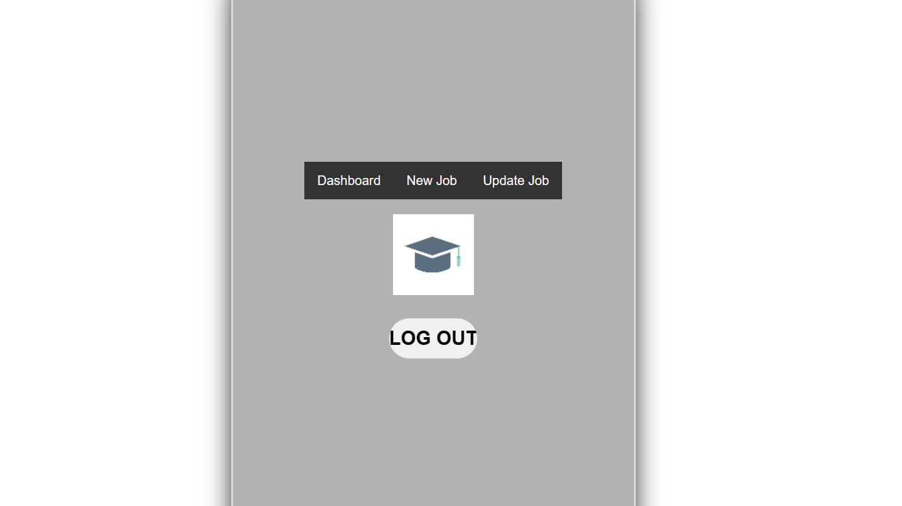

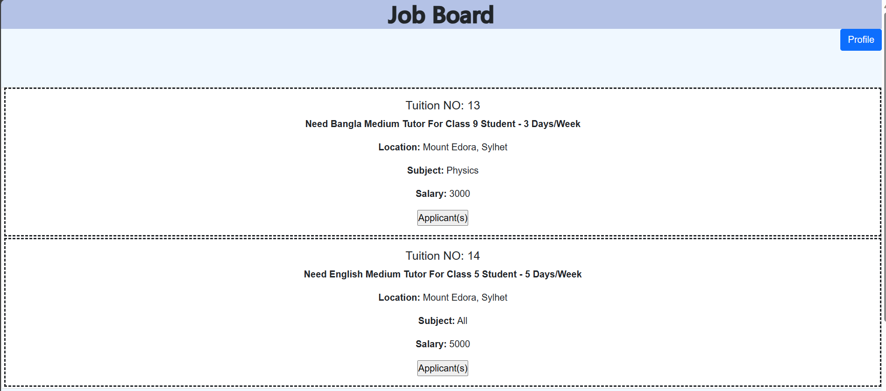

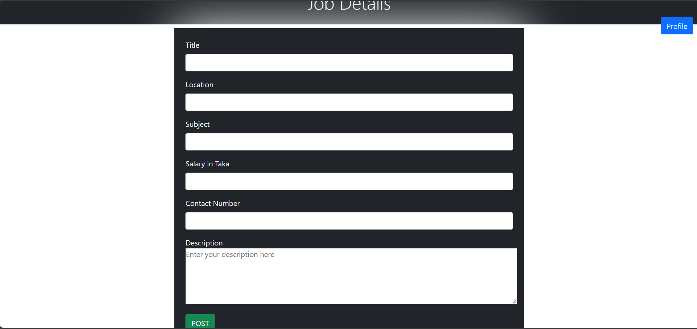

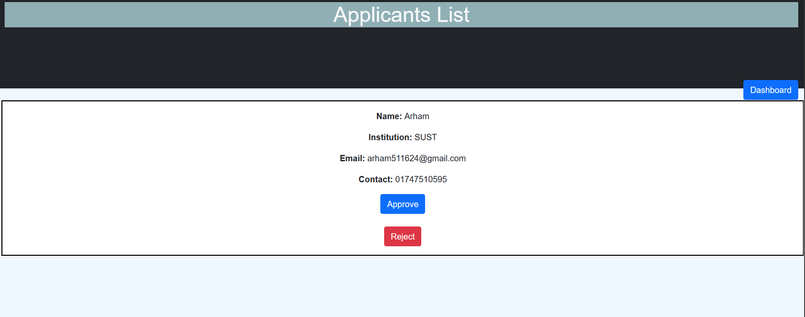

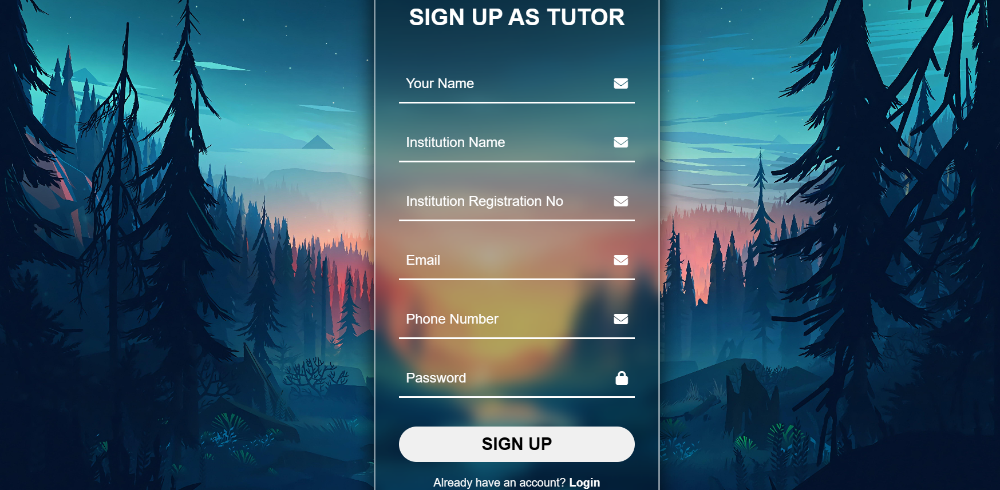

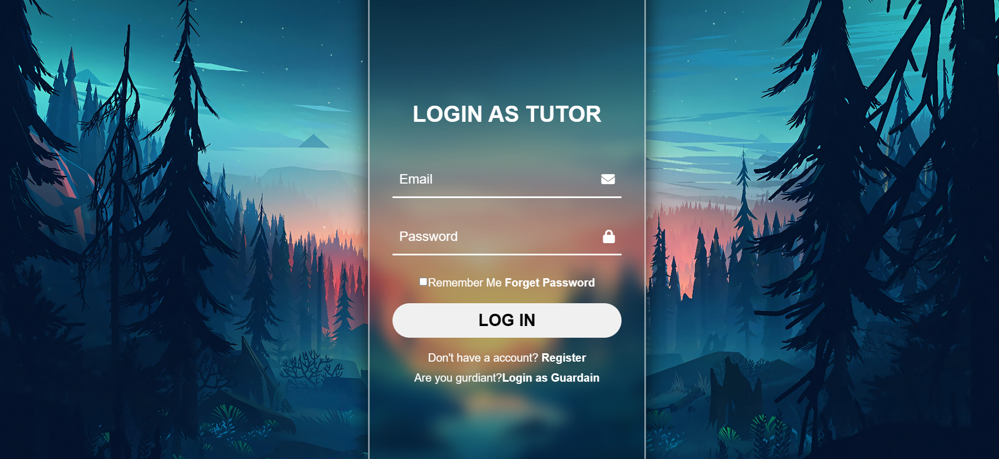

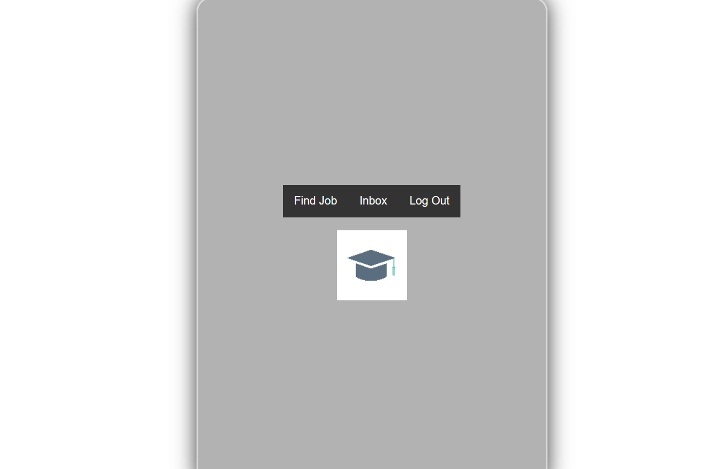

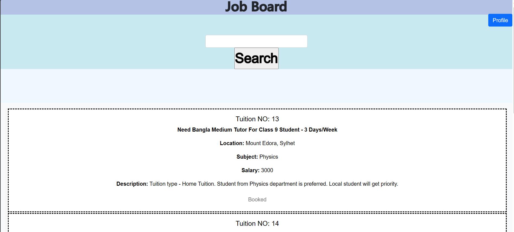

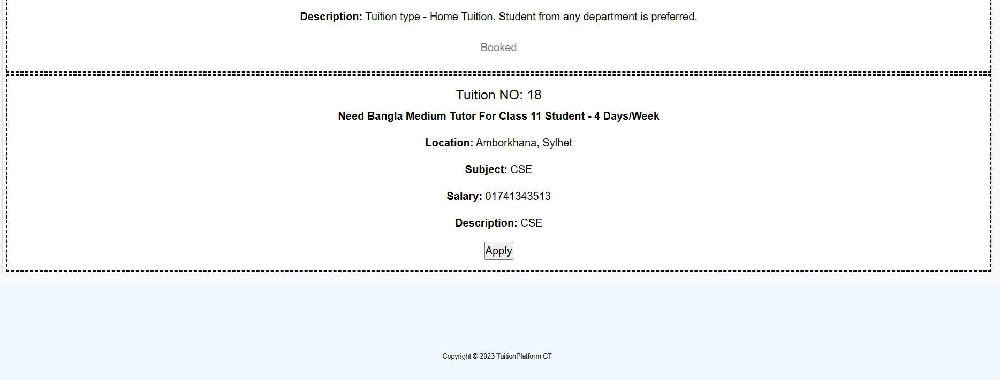

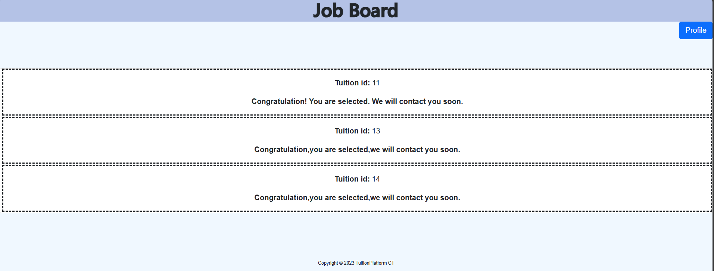

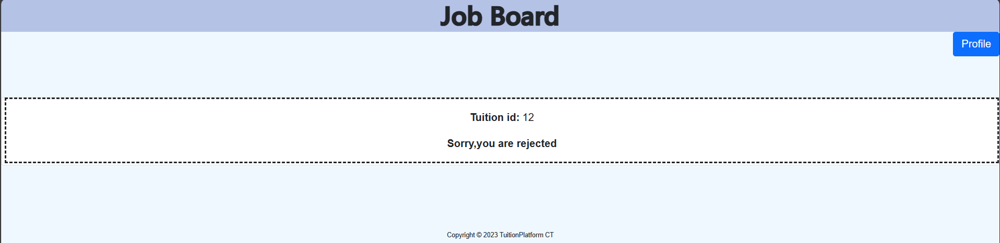

### Thank You For Your Patience!
